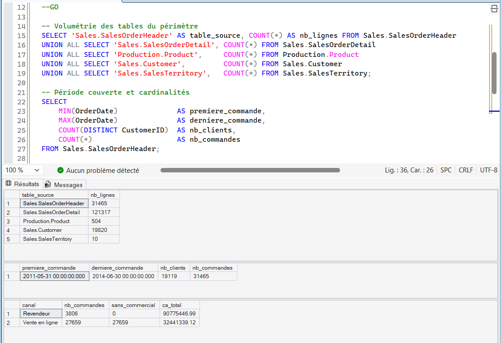

# Projet Analyse des ventes AdventureWorks - SQL Server

Sur quoi repose réellement le chiffre d'affaires d'un distributeur de cycles : sur le volume de clients, sur une poignée de produits, ou sur un noyau restreint d'acheteurs ? Analyse T-SQL de 31 465 commandes sur trois ans.



# Le contexte

AdventureWorks Cycles distribue des vélos et des accessoires sur trois continents, par deux canaux : un réseau de revendeurs et un site de vente en ligne. La base transactionnelle couvre 31 465 commandes passées entre le 31 mai 2011 et le 30 juin 2014.

La question que se poserait une direction commerciale devant ce portefeuille n'est pas « combien avons-nous vendu », mais où se concentre la valeur, et qu'est-ce qui la met en risque. Un chiffre d'affaires porté par quelques comptes ne se pilote pas comme un chiffre d'affaires réparti : les leviers ne sont pas les mêmes, et l'exposition non plus.


Les questions qui meublent notre approche : 

1	Quel est le périmètre, et la donnée est-elle exploitable ?	
2	La dynamique du CA est-elle réelle, ou un effet de cadrage ?	
3	Le CA est-il porté par le volume ou par la marge ?	
4	Quelle part du CA repose sur un noyau de clients ?	
5	Le modèle de vente est-il semblable selon les territoires ?	

Ce que l'analyse montre : 
### 1. 12 % des commandes font 74 % du chiffre d'affaires

Le réseau de revendeurs représente 3 806 commandes sur 31 465, soit 12,1 % du volume - mais 73,7 % du chiffre d'affaires facturé. Le panier moyen revendeur atteint 23 851 $ contre 1 173 $ en ligne, un écart de facteur 20.

La conséquence opérationnelle est directe : tout indicateur de pilotage fondé sur le nombre de commandes décrit l'activité du site web, pas celle qui génère le revenu. Une baisse de 10 % des commandes en ligne coûte environ 3,8 M$ ; la perte de trois comptes revendeurs significatifs coûte davantage.

### 2. Un quart du catalogue porte 80 % du CA, et près de la moitié ne se vend pas

Sur 504 références au catalogue, 266 seulement ont été vendues au moins une fois. Les 238 autres soit 47 % du catalogue n'enregistrent aucune vente sur la période.

Parmi les références actives, la concentration est forte :

Périmètre	Part du CA
10 premiers produits	28,2 %
26 premiers produits	50,0 %
64 premiers produits	80,0 %

Soit 64 références sur 504 pour quatre cinquièmes du revenu. Pour une direction des achats, c'est une question de coût de portage : le catalogue immobilise des référencements qui ne produisent rien.

### 3. Le classement par chiffre d'affaires ne dit rien de la rentabilité

C'est le constat qui porte le plus de valeur métier, et il n'apparaît qu'en croisant deux classements.

Le Road-250 Black, 44 est le 7ᵉ produit en chiffre d'affaires avec 2,52 M$. Il est 255ᵉ sur 266 en marge brute, à -36 367 $, soit un taux de -1,44 %. Vendre davantage de ce produit dégrade le résultat.

Il n'est pas isolé : 56 produits ressortent à marge brute négative, soit 21 % des références vendues. Ils représentent 24,96 M$ de chiffre d'affaires, 22,7 % du total pour une perte cumulée de 1,33 M$.

L'effet se retrouve au niveau des catégories :

| Catégorie | Part du CA | Part de la marge | Taux de marge |
|---|---|---|---|
| Bikes | 86,2 % | 84,7 % | 8,4 % |
| Components | 10,7 % | 5,2 % | 4,2 % |
| Clothing | 1,9 % | 3,3 % | 14,6 % |
| Accessories | 1,2 % | 6,8 % | 50,0 % |

Les accessoires pèsent 1,2 % du chiffre d'affaires mais 6,8 % de la marge. Les composants font l'inverse : dix fois plus de chiffre d'affaires, pour une contribution à la marge plus faible. Les trois casques Sport-100 dépassent chacun 46 % de taux de marge sur plus de 6 000 unités vendues.

Taux de marge global sur la période : 8,53 %. Voir la section Limites quant à la méthode de calcul du coût.

### 4. 19 % des clients portent 73 % du CA - et le second segment est en train de partir
 
La segmentation RFM répartit les 19 119 clients acheteurs en cinq groupes :
 
| Segment | Clients | Part des clients | Part du CA | Récence moyenne | CA par client |
|---|---|---|---|---|---|
| Clients premium | 3 718 | 19,4 % | 72,7 % | 84 j | 24 107 $ |
| À réactiver | 5 311 | 27,8 % | 25,4 % | 317 j | 5 889 $ |
| Clients récents | 3 058 | 16,0 % | 1,4 % | 116 j | 563 $ |
| Clients dormants | 4 249 | 22,2 % | 0,3 % | 266 j | 71 $ |
| Clients fidèles | 2 783 | 14,6 % | 0,2 % | 53 j | 103 $ |
 
Deux segments concentrent **98 % du chiffre d'affaires pour 47 % des clients**. Les trois autres, soit plus de la moitié du fichier, pèsent moins de 2 %.
 
Le point d'attention n'est pas le segment premium mais le second. Les 5 311 clients « à réactiver » ont déjà démontré une valeur de 5 889 $ en moyenne et n'ont pas commandé depuis **317 jours**. C'est le quart du chiffre d'affaires qui se trouve sur une trajectoire de sortie, et c'est sur ce segment qu'une action de reconquête a le meilleur rapport coût/rendement : la base est connue, l'historique d'achat existe, le coût d'acquisition est déjà payé.

### 5. Trois territoires américains fonctionnent sur un modèle entièrement différent
 
Central, Southeast et Northeast n'ont pratiquement aucune vente en ligne, moins de 0,2 % de leur chiffre d'affaires. Ensemble, ces trois territoires réalisent **20,8 % du chiffre d'affaires sur 3,9 % des commandes**, avec des paniers de 18 000 à 23 000 $. Ce sont des territoires de gros, pilotés par une poignée de comptes : 57 à 91 clients chacun.

À l'opposé, l'Australie réalise 84,8 % de son chiffre d'affaires en ligne avec un panier de 1 726 $. Un comparatif de performance entre ces territoires sur la base du panier moyen ou du nombre de commandes n'a aucun sens : ils ne vendent pas la même chose aux mêmes acheteurs.
 
### 6. La tendance apparente est en partie un artefact de période

| Année | Commandes | CA HT | Évolution |
|---|---|---|---|
| 2011 | 1 607 | 12,64 M$ | - (7 mois) |
| 2012 | 3 915 | 33,52 M$ | +165,2 % |
| 2013 | 14 182 | 43,62 M$ | +30,1 % |
| 2014 | 11 761 | 20,06 M$ | - 54,0 % (6 mois) |
 
Le recul de 2014 n'existe pas : les données s'arrêtent au 30 juin. De même, 2011 ne couvre que sept mois, dont un seul jour de mai. **Seules 2012 et 2013 sont comparables** : sur ces deux exercices complets, le chiffre d'affaires progresse de 30,1 % tandis que le nombre de commandes augmente de 262 %.
 
Cet écart entre croissance du revenu et croissance du volume est la signature d'un changement de mix : le panier moyen est divisé par 4,6 entre 2011 et 2014. L'hypothèse la plus probable est la montée en charge du canal en ligne, cohérente avec le constat n° 1 - mais la ventilation du canal par année n'a pas été produite dans cette analyse, et l'hypothèse reste donc à vérifier.

## Les données
 
Base **AdventureWorks2022**, version OLTP, restaurée dans un conteneur SQL Server 2022.
 
| Table | Lignes | Rôle |
|---|---|---|
| `Sales.SalesOrderHeader` | 31 465 | En-tête de commande - une ligne par commande |
| `Sales.SalesOrderDetail` | 121 317 | Lignes de commande - 3,86 par commande en moyenne |
| `Production.Product` | 504 | Catalogue produits |
| `Sales.Customer` | 19 820 | Fichier clients |
| `Sales.SalesTerritory` | 10 | Territoires commerciaux |
 
 
**Période** : 31/05/2011 → 30/06/2014.
**Clients acheteurs** : 19 119 sur 19 820 au fichier. Les 701 écarts (3,5 %) sont des comptes sans commande ; la segmentation porte sur les acheteurs.

## Les scripts
 
```
sql/
├── 01_exploration.sql            Périmètre, contrôles de cohérence, valeurs manquantes
├── 02_ca_par_annee.sql           Évolution annuelle et mensuelle, comparaison N-1
├── 03_top_produits.sql           CA, marge brute, concentration, double classement
├── 04_segmentation_clients.sql   Scoring (Récurence, Fréquence, Montant) et segmentation métier
└── 05_analyse_geographique.sql   Territoires et mix de canaux
```